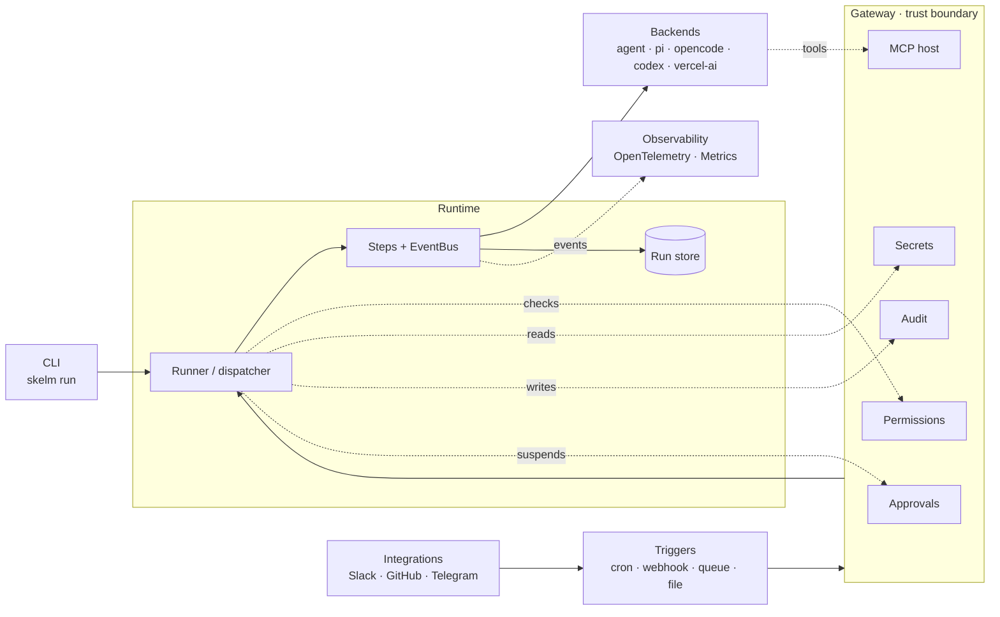

# Architecture

A one-page tour of how skelm fits together. For per-component depth, follow the links in [Where to go next](#where-to-go-next) or the other pages under [Concepts](./).

## Mental model

skelm runs **pipelines** — typed, inspectable orchestrations made of steps. A pipeline can be a single agent or a multi-step workflow with branches and loops. Two things execute pipelines: the **CLI** for one-shot runs, and the **gateway** — a long-running service that owns the trust boundary, hosts triggers, and dispatches runs. Steps call **backends** (agent runtimes or LLMs) and **MCP servers** for tools. The gateway enforces permissions, resolves secrets, writes audit, and gates approvals before any privileged action lands.

## Diagram

## Walk-through

### Entry points

- **`skelm run <pipeline>`** loads a pipeline file and runs it locally. Source: [`packages/cli/src/run.ts`](https://github.com/scottgl9/skelm/blob/main/packages/cli/src/run.ts).
- **`skelm gateway start`** boots the long-running service that owns triggers, the run store, MCP hosting, and enforcement. Source: [`packages/cli/src/gateway.ts`](https://github.com/scottgl9/skelm/blob/main/packages/cli/src/gateway.ts) → [`packages/gateway/src/lifecycle/gateway.ts`](https://github.com/scottgl9/skelm/blob/main/packages/gateway/src/lifecycle/gateway.ts).

Both paths converge on the same runtime. The CLI path uses an in-process enforcement stack; the gateway path uses the shared service-wide one.

### Pipeline → runtime

A pipeline file exports a `Pipeline` object. The **Runner** ([`packages/core/src/runner.ts`](https://github.com/scottgl9/skelm/blob/main/packages/core/src/runner.ts)) wraps an `ExecutionRuntime` that walks the step graph one node at a time. Each step emits typed `RunEvent`s on an `EventBus`; a `RunStore` persists runs and events so long-running workflows can resume after restart.

### Gateway — the trust boundary

All privileged work routes through the gateway. It owns:

- **Permission enforcement** — [`packages/core/src/enforcement/permission-resolver.ts`](https://github.com/scottgl9/skelm/blob/main/packages/core/src/enforcement/permission-resolver.ts) evaluates tool, network, and filesystem policies. Default-deny on omission.
- **Secret resolution** — file or vault resolvers under [`packages/gateway/src/secrets/`](https://github.com/scottgl9/skelm/tree/main/packages/gateway/src/secrets) inject secrets into step contexts.
- **Audit** — a single chained writer ([`packages/gateway/src/audit/chain.ts`](https://github.com/scottgl9/skelm/blob/main/packages/gateway/src/audit/chain.ts)) records actor / action / payload tuples.
- **Approvals** — [`packages/gateway/src/approvals/suspend-gate.ts`](https://github.com/scottgl9/skelm/blob/main/packages/gateway/src/approvals/suspend-gate.ts) suspends agent steps pending human review.
- **MCP hosting** — [`packages/gateway/src/managers/mcp-server-manager.ts`](https://github.com/scottgl9/skelm/blob/main/packages/gateway/src/managers/mcp-server-manager.ts) spawns and supervises MCP server processes; runners attach them to steps.

A guard at `scripts/guards/gateway-only-enforcement.ts` fails the build if new privileged calls land outside this path without an explicit annotation.

### Backends

A step picks a backend by ID (`agent`, `pi`, `opencode`, `codex`, `vercel-ai`). The contract is small — `infer()` for `llm()` steps and `run()` for `agent()` steps — declared in [`packages/core/src/backend.ts`](https://github.com/scottgl9/skelm/blob/main/packages/core/src/backend.ts). Implementations live under their own packages so each can be installed (or omitted) independently.

### Triggers

The gateway runs a [`TriggerCoordinator`](https://github.com/scottgl9/skelm/blob/main/packages/gateway/src/triggers/coordinator.ts) that owns cron, intervals, webhooks (with idempotency), file watches, and integration-supplied queues (Slack, GitHub, Telegram, MS Graph, …). When a trigger fires, the [dispatcher](https://github.com/scottgl9/skelm/blob/main/packages/gateway/src/triggers/dispatcher.ts) resolves the workflow and spawns a Runner under the gateway's enforcement.

### Integrations & MCP

- **Integrations** ([`packages/integrations/`](https://github.com/scottgl9/skelm/tree/main/packages/integrations)) ship typed connectors and trigger drivers — the connectors are the wire to outside systems.
- **MCP** — tools that backends call are hosted by the gateway, not by the backend or the step. This keeps secret access and permission checks on a single side of the trust boundary.

### Observability

- **OpenTelemetry** — [`packages/otel/src/index.ts`](https://github.com/scottgl9/skelm/blob/main/packages/otel/src/index.ts) subscribes to the EventBus and emits spans per run and step.
- **Metrics** — [`packages/metrics/src/index.ts`](https://github.com/scottgl9/skelm/blob/main/packages/metrics/src/index.ts) accumulates Prometheus-shaped histograms, counters, and gauges (step duration, denials, pending approvals, trigger fires).

Both are opt-in and attach at runtime; the runtime works without them.

## Where to go next

- [Permissions](./permissions.md) — how default-deny is structured.
- [Coding Agents](./coding-agents.md) — what `agent()` steps actually do.
- [Gateway guide](../guides/gateway.md) — running the gateway in development and production.
- [Triggers guide](../guides/triggers.md) — wiring cron, webhooks, queues, and file watches.
- [Backends overview](../backends/) — picking and configuring a backend.
- [Reference](../reference/) — generated API docs.
